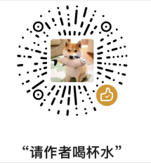

# wechat_article
基于QueryList的微信公众号文章获取工具
- [X] 文章标题
- [x] 文章作者
- [x] 文章原创标识  
- [x] 文章正文  
- [x] 文章发布时间  
- [x] 文章简介  
- [x] 文章原始url
- [x] 文章主图
- [x] 文章公众号名称
- [x] 文章内视频资源的地址获取
- [x] 文章音频资源的地址获取
- [x] 文章音频资源的时长获取
- [x] 文章音频资源的容量获取
- [ ] 资源的下载

#### 安装教程
```bash
composer require fawkes/wechat_article
```
#### 测试地址
```php
use fawkes\wechat_article\wechatArticle;
use fawkes\wechat_article\wechatArticleException;
use fawkes\wechat_article\wechatArticleVideo;

try {
    $url = $_GET['url'] ?? "https://mp.weixin.qq.com/s/8_NJAZMnjsBmalJ9QQf17w";
    $articleClass = new wechatArticle;
    //通过HTML页面抓取内容
    $article = $articleClass->crawQueryByUrl($url);
    var_dump($article);
    //通过接口返回内容
    $article = $articleClass->crawJSONQueryByUrl($url);
//    print_r($article['content']);
    unset($article['content']); //内容过长影响展示
    var_dump($article);
    var_dump($articleClass->title);
    die;
     //查看文章内的视频和音频
    $video = new  wechatArticleVideo();
    $ffmpegUtil = new \fawkes\wechat_article\FfmpegUtil();
    $info_arr = $video->actionGetwx($url);
    //查看信息
    var_dump($info_arr);;
} catch (wechatArticleException $e) {
    var_dump($e->getMessage());
    var_dump($e->getTrace());
}
```
#### 使用说明

```php
use fawkes\wechat_article\wechatArticle;
use fawkes\wechat_article\wechatArticleException;

class Controller{
        /**
         * 获取文章的内容
         * @param Request $request
         */
        public function article(Request $request){
            $articleInfo = new wechatArticle();
            try {
                $articleInfo->setHttpToImg('/图片防盗链设置的接口?imgUrl='); //当前防盗链请求地址
                $article = $articleInfo->crawQueryByUrl("https://mp.weixin.qq.com/s/YuhmAYMLgCxktxVo1bgmCQ");
                print_r($article['content']);
                unset($article['content']);
                var_dump($article);
            } catch (wechatArticleException $e) {
                var_dump($e->getMessage());
            }
        }
    
        /**
         * 图片防盗链的处理
         * @param Request $request
         * @return \think\Response
         */
        public function proxy(Request $request){
            $articleInfo = new wechatArticle();
            $imgUrl = $request->param('imgUrl');
            $headers = [];
            $headers['Content-Type'] = 'image/png';
            $content = $articleInfo->getImg($imgUrl);
            return response($content,200,$headers);
        }
}
```

### 感谢打赏

